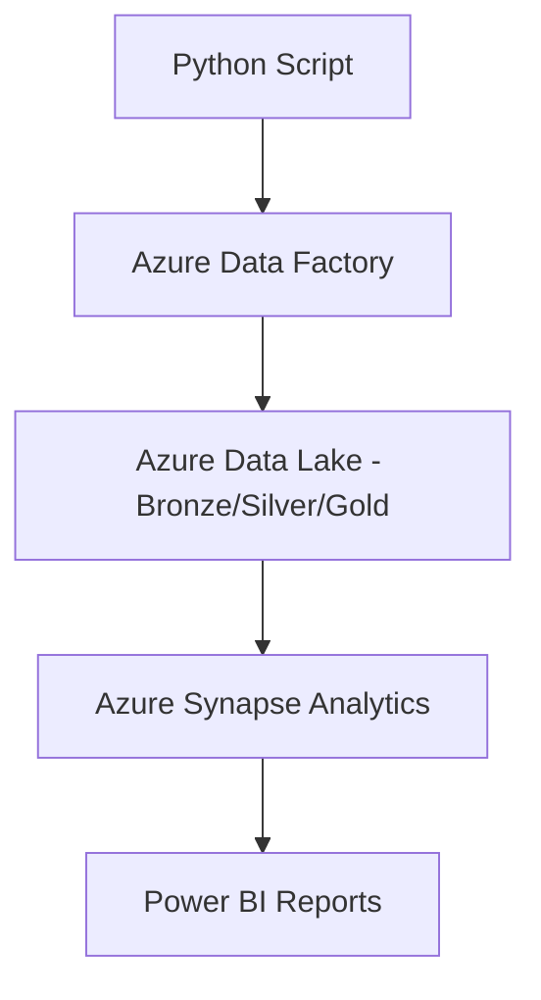

# 🛍️ Retail Sales Analytics on Azure

An end-to-end Retail Sales Analytics project built on Azure, showcasing modern data engineering practices using Python, Azure Data Factory (ADF), Azure Data Lake Storage Gen2, Azure Synapse Analytics, and Power BI. 

This project demonstrates how raw retail sales data can be ingested, transformed, analyzed, and visualized using a scalable cloud-based architecture.

---

## 🚀 Project Architecture



🧱 Tech Stack
```
Component	Technology
Language	Python
Orchestration	Azure Data Factory
Storage	Azure Data Lake Gen2
Data Processing	Azure Synapse Analytics
Visualization	Power BI
```

📂 Project Structure
```
retail-sales_analytics/
│
├── data/                       # Raw CSV files (input datasets)
├── python_ingestion/          # Python scripts for initial data push
├── adf_pipelines/             # JSON exports of ADF pipelines
├── synapse_queries/           # SQL scripts for DDL + transformations
├── powerbi_reports/           # PBIX files / screenshots
├── README.md
└── architecture.png           # Architecture Diagram
```

📈 Business Use Case
Objective: Analyze retail sales data to uncover trends, high-performing regions/products, and forecast revenue.

Data Source: Retail transactions CSV file (uploaded manually or automated).

Users: Business analysts, operations teams, and sales managers.

🔄 Data Flow Pipeline
Ingestion:

Python scripts upload raw .csv files to Azure Data Lake (Bronze layer).

Orchestration via ADF triggers.

Transformation:

ADF Mapping Data Flows process and clean data from Bronze → Silver → Gold layers.

Derived columns such as Profit, OrderMonth, CategorySales.

Modeling:

Data from Gold layer is loaded into Azure Synapse for analytics modeling.

Views and aggregations created for Power BI consumption.

Reporting:

Power BI dashboards built to display KPIs like Total Sales, Profit Margin, Regional Revenue, and Product Category Trends.

